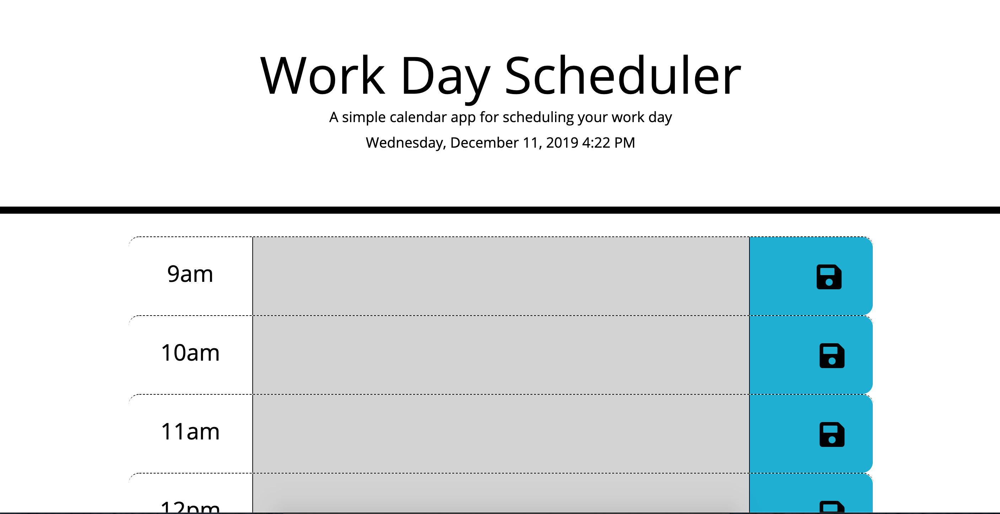

# Day-Planner

This application is designed to aid the user in their daily planning: dynamically marking the time of day with color, and saving and restoring the user's text inputs.

## Interface
This planner has an admittedly simple interface and styling. The user simply needs to input their text and click on the save button— the program does the rest.

As the business day progresses, the textbox colors change from green (future hours) to red (the current hour) to grey (hours past).

## Technologies

This site was written using:
* Bootstrap 4
* Javascript

## Credits

In setting up this project, I closely followed the guidelines provided by the [UCF Coding Bootcamp](https://github.com/UCF-Coding-Boot-Camp/UCF-ORL-FSF-FT-11-2019-U-C).